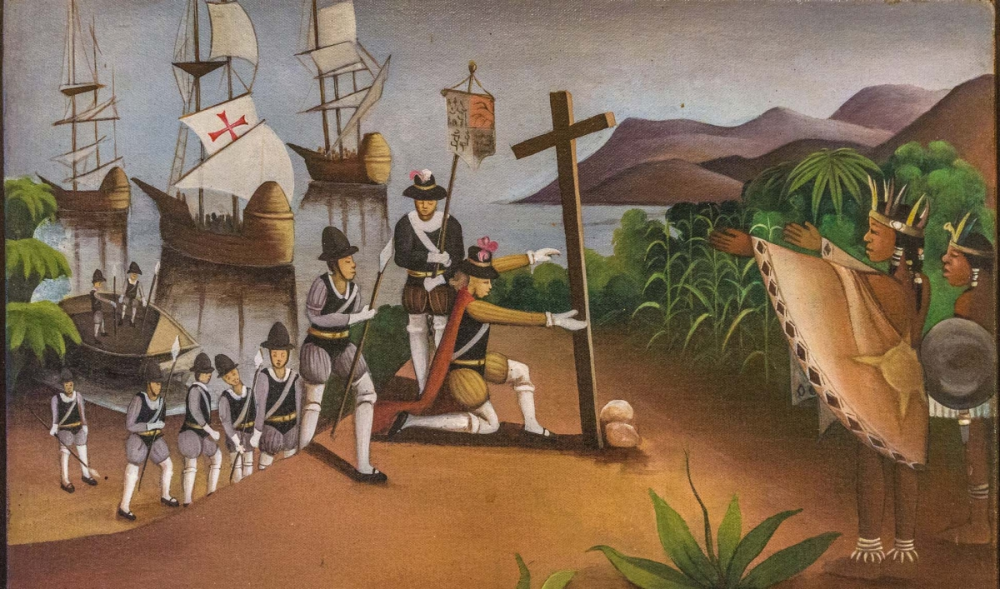

# Colonial Battle Board Game!

<p align="center">
  
</p>

## Setup

To setup the game, clone this repository and install the dependencies:

```bash
pip install -r requirements.txt
```

## Playing a game

To start playing a game, we need to implement [_agents_](agents/agent.py). For example, to play the game using two random agents (agents which take a random action), run the following:

```bash
python simulator.py --player_1 random_agent --player_2 random_agent
```

This will spawn a random game board of size NxN, and run the two agents of class [RandomAgent](agents/random_agent.py). You will be able to see their moves in the console.

## Visualizing a game

To visualize the moves within a game, use the `--display` flag. You can set the delay (in seconds) using `--display_delay` argument to better visualize the steps the agents take to win a game.

```bash
python simulator.py --player_1 random_agent --player_2 random_agent --display
```

## Play on your own!

To play the game on your own, use a [`human_agent`](agents/human_agent.py) to play the game.

```bash
python simulator.py --player_1 human_agent --player_2 random_agent --display
```


## Game Rules

<p align="center">
  
</p>

### Game Setting
On an *M* x *M* chess board, 2 players are randomly distributed on the board with one player occupying one block.

### Game Moving
In each iteration, one player moves at most `K` steps (between `0` and `K`) in either horizontal or vertical direction, and must put a barrier around him or her in one of the 4 directions except the boarders of the chess board. The players move in a round-robin way.

#### Note: 
 - Each player cannot go into other player's place or put barriers in areas that already have barriers.
 - Currently the maximal number of steps is set to `K = (M + 1) // 2`.

### Game Ending
The game ends when each player is separated in a closed zone by the barriers and boundaries. The final score for each player will be the number of blocks in that zone.

### Goal
Each player should maximize the final score of itself, i.e., the number of blocks in its zone in the endgame.


## License

[MIT](LICENSE)

